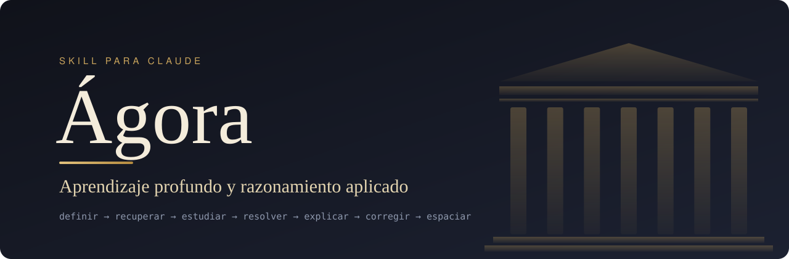

<p align="center">
  
</p>

<p align="center">
  <a href="README.md">English</a> · <b>Español</b> · <a href="README.pt-BR.md">Português</a>
</p>

<p align="center">
  <b>Un sistema operativo de aprendizaje que convierte a Claude en tu diseñador de plan,<br>
  director de sesión, tutor socrático y evaluador, en tu propio idioma.</b>
</p>

---

## Por qué existe

Releer, subrayar y acumular horas *se siente* productivo, pero rinde poco. Las técnicas que mejor funcionan (recuperar sin mirar, espaciar los repasos, intentar antes de ver la solución, explicar y recibir crítica) son incómodas y difíciles de sostener sin alguien que te guíe.

Ágora es ese alguien. Toma las prácticas más transferibles de las universidades de referencia y las convierte en un ciclo diario, medible y adaptativo que funciona con cualquier materia y en cualquier idioma.

> **Ágora no promete subir el IQ ni lo mide.** Entrena y mide **rendimiento observable**: comprensión profunda, transferencia a problemas nuevos, claridad al explicar y calidad de lo que produces.

## Qué hace

| Modo | Qué pasa |
|---|---|
| **Inicio** | 6 preguntas (objetivo, materia, perfil, tiempo, energía, con quién discutes) y creación de tu cuaderno de progreso. |
| **Diagnóstico** | 85 minutos (o en 2 partes, o en 3 días de 30): lectura, memoria, lógica, problemas, escritura, explicación, metacognición y atención. Asigna nivel: Fundamentos, Intermedio, Avanzado o Intensivo. |
| **Plan de 12 semanas** | Cada semana entrena una habilidad cognitiva usando el temario de *tu* materia. |
| **Sesión diaria** | Rutinas exactas de 30, 60, 120 o 180 minutos en 7 pasos. |
| **Tutoría socrática** | No te da la respuesta: pide tu intento, cuestiona supuestos, plantea contraejemplos y sube la dificultad, con una escalera de pistas de H1 a H5. |
| **Modo atención** | Formato opcional pensado para el TDAH: bloques de 10 a 20 minutos con una sola tarea visible, pausas con movimiento, ritual de arranque, máximo 8 tarjetas al día, regresos en lugar de rachas y un freno a la hiperconcentración. |
| **Tu material** | Lee tus PDF, apuntes y temario, los conecta con el plan y crea tarjetas y problemas que citan páginas. Los exámenes anteriores se reservan para la prueba final. |
| **Repaso espaciado** | Programación con FSRS-6 mediante un script sin dependencias (si no hay Python, usa cajas Leitner). |
| **Revisiones** | Métricas semanales y mensuales con reglas explícitas para subir o bajar la dificultad. |
| **Proyectos** | Proyectos finales de STEM, humanidades, negocios/decisión, diseño e idiomas. |
| **Manual** | Genera el sistema completo como documento, en tu idioma. |

Funciona para estudiantes de secundaria avanzada, universitarios, profesionales que aprenden una habilidad compleja y autodidactas sin profesor.

## Cualquier idioma

El skill está escrito en inglés y **le habla a cada persona en su idioma** (español, portugués, italiano, francés, alemán, inglés…): preguntas, feedback, rúbricas, plantillas y el prompt del tutor. Los nombres de archivo se mantienen en inglés para que los scripts sigan funcionando.

Si la materia *es* un idioma, las instrucciones llegan en tu idioma y la práctica ocurre en el idioma meta, con más inmersión a medida que sube tu nivel (alrededor de 30 % → 60 % → 90 %).

## Modo atención (pensado para el TDAH)

Es opcional y nunca diagnostica. Mantiene los métodos que también funcionan con TDAH (la práctica de recuperación ayuda igual que al resto) y cambia el formato: bloques cortos con una sola tarea visible, pausas con movimiento, planes "si… entonces…" para las distracciones, una lista de pendientes, una microsesión de 10 minutos para días de poca energía, repasos limitados, regresos en lugar de rachas y avisos de tiempo para que la hiperconcentración no le quite horas al sueño. No da consejos sobre medicación ni ofrece "entrenamiento cerebral", que no mejora los síntomas ni las notas en mediciones ciegas. Mira [`agora/references/attention.md`](agora/references/attention.md) y [una sesión de ejemplo](examples/session-attention-mode.es.md).

## Instalación

**Un comando (cualquier agente compatible con skills).**

```bash
npx skills add Mlle-LondonG/agora-skill
```

**Plugin de Claude Code.** Dentro de una sesión:

```text
/plugin marketplace add Mlle-LondonG/agora-skill
/plugin install agora@agora-skill
```

**App de Claude (web o escritorio).** Descarga [`agora.zip`](agora.zip) (o el adjunto a la [última versión](../../releases/latest)) y súbelo en la sección de Skills de la configuración.

**Claude Code, a mano.** Copia la carpeta `agora/` en tus skills personales o en las de un proyecto:

```bash
git clone https://github.com/Mlle-LondonG/agora-skill.git
cp -r agora-skill/agora ~/.claude/skills/          # para todos tus proyectos
# o bien: cp -r agora-skill/agora .claude/skills/  # solo para este proyecto
```

**Otra IA.** `agora/references/tutor.md` incluye un prompt de tutor socrático listo para pegar (si se lo pides a Ágora, te lo da traducido).

**Si tenías la versión 1.x.** Quita primero la versión anterior en español. Ágora migra los cuadernos de 1.x (`perfil.md`, `sesiones.csv`…) al formato nuevo, conservando todas las filas y una copia de los originales.

## Cómo empezar

Escribe **"Ágora"** en una conversación. La primera vez te hará las preguntas de inicio y te propondrá el diagnóstico. Después:

```text
Ágora, sesión de 60 minutos
Ágora, tutoría sobre recursión
Ágora, ¿cómo voy?
Ágora, estoy atascada con las integrales
Ágora, aquí están mis apuntes (adjunta los PDF)
Ágora, dame el manual completo
```

Mira [una sesión de ejemplo en español](examples/session-30-min.es.md).

## El método

### Cada sesión

| Paso | 30 min | 60 min | 120 min | 180 min |
|---|---|---|---|---|
| 1. Definir el resultado | 1 | 2 | 3 | 5 |
| 2. Recuperar sin mirar | 5 | 10 | 15 | 20 |
| 3. Estudiar con pregunta guía | 7 | 15 | 30 | 45 |
| Pausa | — | — | 5 | 10 |
| 4. Resolver algo difícil | 9 | 18 | 35 | 50 |
| Pausa | — | — | — | 5 |
| 5. Explicar y defender | 4 | 7 | 15 | 20 |
| 6. Corregir con evidencia | 2 | 5 | 10 | 15 |
| 7. Registrar y espaciar | 2 | 3 | 7 | 10 |

### Las 12 semanas

| Fase | Semanas | Competencias |
|---|---|---|
| **I. Base del sistema** | 1–4 | Atención profunda · memoria y calibración · primeros principios · lectura crítica |
| **II. Razonamiento** | 5–8 | Lógica y causalidad · probabilidad y decisión · problemas cuantitativos · escritura y defensa oral |
| **III. Transferencia y producción** | 9–12 | Creatividad e hipótesis · transferencia · proyecto integrador · defensa y diagnóstico final |

### Dificultad adaptativa

| Si la recuperación sin apuntes es… | Ágora… |
|---|---|
| menor que 60 % | no da contenido nuevo: recuperación, ejemplos resueltos y prerrequisitos |
| 60–79 % | reduce el contenido nuevo a la mitad y duplica la recuperación |
| 80–90 % | mantiene la dificultad y espacia los repasos |
| mayor que 90 % dos veces **y** hay transferencia | sube la complejidad |

Ante fallos repetidos distingue cinco causas, en este orden: fatiga, prerrequisitos, estrategia, falta de feedback o dificultad excesiva. Incluye reglas de descanso (6+1, techo diario, sueño) para evitar el agotamiento.

### Qué toma de cada institución

| | Práctica | En Ágora |
|---|---|---|
| **Harvard** | Método de casos, instrucción entre pares | Caso semanal con decisión defendida; pares simulados |
| **MIT** | Aprender haciendo, problemas rigurosos | La mayor parte de cada sesión se resuelve |
| **Cambridge** | Supervisiones en grupos muy pequeños | Producción semanal defendida ante el tutor |
| **Stanford** | Diseño, prototipado e iteración | Semana de creatividad y proyecto de diseño |

Ninguna de estas universidades usa un único método; Ágora toma prácticas concretas, no "el método de X".

## Tu cuaderno

Con acceso a una carpeta, Ágora guarda tu progreso en archivos; sin él, te da un bloque de estado para pegar la próxima vez. Puedes partir de [`notebook-template/`](notebook-template): `profile.md` (objetivo, nivel, plan), `sessions.csv` (una fila por sesión), `errors.md` (errores por tipo), `cards.csv` (tarjetas con estado FSRS y páginas de la fuente), `reviews.md` (revisiones) y `sources.md` (tu material).

```bash
python3 agora/scripts/fsrs.py due cards.csv              # qué repasar hoy
python3 agora/scripts/fsrs.py review cards.csv c12 good  # registrar un repaso
python3 agora/scripts/metrics.py sessions.csv --days 7   # resumen semanal + regla sugerida
```

`fsrs.py` es una adaptación de FSRS-6 tomada de [py-fsrs](https://github.com/open-spaced-repetition/py-fsrs); en 1924 repasos simulados coincidió exactamente con las fechas de la librería de referencia.

## Evidencia y límites

Cada práctica está etiquetada como **evidencia sólida**, **evidencia moderada** o **sugerencia práctica**. Las referencias están en [`agora/references/evidence.md`](agora/references/evidence.md).

Ágora **no sustituye la ayuda profesional** para TDAH, ansiedad, depresión, trastornos del sueño u otras condiciones.

## Contribuir

¿Lo usaste y algo no funcionó, o se te ocurre una mejora? Abre un *issue* con lo que pasó, qué esperabas y, si puedes, un fragmento de la conversación.

## Licencia

[MIT](LICENSE) · Hecho por [@Mlle-LondonG](https://github.com/Mlle-LondonG).
