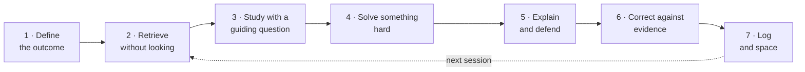

<p align="center">
  
</p>

<p align="center">
  <a href="LICENSE"></a>
  
  
  
  
</p>

<p align="center">
  <b>Un système d’exploitation de l’apprentissage qui transforme Claude en concepteur de plans,<br>
  directeur de séances, tuteur socratique et évaluateur — dans votre propre langue.</b>
</p>

<p align="center">
  <a href="#installation">Installation</a> ·
  <a href="#pour-commencer">Pour commencer</a> ·
  <a href="#la-méthode">La méthode</a> ·
  <a href="examples/session-30-min.md">Voir une séance</a> ·
  <a href="agora/SKILL.md">Lire le skill</a>
  <br>
  <a href="README.md">English</a> · <a href="README.es.md">Español</a> · <a href="README.pt-BR.md">Português</a> · <a href="README.it.md">Italiano</a> · <b>Français</b>
</p>

---

## Pourquoi ce projet existe

Relire, surligner et consigner des heures de travail _donnent_ une impression de productivité, mais rapportent peu. Les techniques les plus efficaces (se remémorer sans regarder, espacer les révisions, essayer avant de voir la solution, expliquer et accepter la critique) sont inconfortables et difficiles à maintenir sans accompagnement.

Ágora est cet accompagnement. Il reprend les pratiques les plus transposables des grandes universités et les transforme en une boucle quotidienne, mesurable et adaptative, qui fonctionne pour n’importe quelle matière et dans n’importe quelle langue.

> **Ágora ne promet pas d’augmenter le QI et ne le mesure jamais.** Il entraîne et mesure des **performances observables** : compréhension approfondie, transfert à de nouveaux problèmes, explications claires et qualité de ce que vous produisez.

## Ce qu’il fait

| Mode                     | Ce qui se passe                                                                                                                                                                                                                              |
| ------------------------ | -------------------------------------------------------------------------------------------------------------------------------------------------------------------------------------------------------------------------------------------- |
| **Onboarding**           | 6 questions (objectif, matière, profil, temps, énergie, personne avec qui vous échangez) et votre carnet de progression est créé.                                                                                                            |
| **Diagnostic**           | 85 minutes (ou 2 parties, ou trois journées de 30 minutes) : lecture, mémoire, logique, problèmes, rédaction, explication, métacognition et attention. Attribue un niveau : Foundations, Intermediate, Advanced ou Intensive.                |
| **Plan sur 12 semaines** | Chaque semaine entraîne une compétence cognitive à partir du programme de _votre_ matière.                                                                                                                                                   |
| **Séance quotidienne**   | Des routines précises de 30, 60, 120 ou 180 minutes en 7 étapes.                                                                                                                                                                             |
| **Tutorat socratique**   | Ne donne jamais la réponse : demande votre tentative, examine vos hypothèses, propose des contre-exemples et augmente la difficulté, avec une échelle d’indices de H1 à H5.                                                                  |
| **Mode attention**       | Présentation optionnelle adaptée au TDAH : blocs de 10 à 20 minutes avec une seule tâche visible, pauses de mouvement, rituel de démarrage, au plus 8 cartes par jour, reprises plutôt que séries, et garde-fou contre l’hyperconcentration. |
| **Vos supports**         | Lit vos PDF, notes et programme, les associe au plan, et rédige des cartes et des problèmes qui citent les pages. Les examens passés sont mis de côté pour le test final.                                                                    |
| **Répétition espacée**   | Planification FSRS-6 avec un script sans dépendances (repli sur les boîtes de Leitner lorsque Python n’est pas disponible).                                                                                                                  |
| **Révisions**            | Mesures hebdomadaires et mensuelles, avec des règles explicites pour augmenter ou réduire la difficulté.                                                                                                                                     |
| **Projets**              | Projets de synthèse en STEM, en sciences humaines, en entreprise et prise de décision, en design et en langues.                                                                                                                              |
| **Manuel**               | Génère l’ensemble du système sous forme de document, dans votre langue.                                                                                                                                                                      |

Il convient aux élèves du secondaire avancé, aux étudiants, aux professionnels qui apprennent une compétence complexe et aux autodidactes sans enseignant.

## N’importe quelle langue

Le skill est écrit en anglais et **s’adresse à chaque apprenant dans sa propre langue** (espagnol, portugais, italien, français, allemand, anglais…) : questions, retours, grilles d’évaluation, modèles et prompt du tuteur. Les noms de fichiers restent en anglais pour que les scripts continuent de fonctionner.

Lorsque la matière _est_ une langue, les consignes sont données dans votre langue et la pratique se déroule dans la langue cible, avec davantage d’immersion à mesure que votre niveau progresse (environ 30 % → 60 % → 90 %).

```text
Ágora, 60-minute session
Ágora, sesión de 60 minutos
Ágora, sessão de 60 minutos
Ágora, sessione di 60 minuti
```

## Mode attention (adapté au TDAH)

Activable à la demande, il ne constitue jamais un diagnostic. Il conserve les méthodes qui fonctionnent aussi pour les étudiants avec un TDAH (la pratique de récupération les aide autant que leurs pairs) et en modifie la présentation : blocs courts avec une seule tâche visible, pauses de mouvement, plans « si-alors » pour les distractions, une « liste de stationnement », une micro-séance de 10 minutes pour les jours de faible énergie, des révisions plafonnées, des reprises plutôt que des séries et des vérifications de l’heure afin que l’hyperconcentration ne rogne pas sur le sommeil. Aucun conseil médicamenteux ni « entraînement cérébral », qui n’améliore ni les symptômes du TDAH ni les notes dans les mesures en aveugle. Voir [`agora/references/attention.md`](agora/references/attention.md) et [un exemple de séance](examples/session-attention-mode.md).

## Installation

**Depuis l’annuaire de Claude (le plus simple).** Ágora Learning figure dans l’annuaire officiel des plugins d’Anthropic. Dans Claude (web, bureau, Cowork ou Claude Code), ouvrez **Customize**, cherchez **Ágora Learning** et ajoutez-le.

**Une commande (avec tout agent prenant en charge les skills).**

```bash
npx skills add Mlle-LondonG/agora-skill
```

**Plugin Claude Code.** Dans une session :

```text
/plugin marketplace add Mlle-LondonG/agora-skill
/plugin install agora-learning@agora-skill
```

**Application Claude (web ou bureau).** Téléchargez `agora.zip` depuis la [dernière version](../../releases/latest) et importez-le dans la section Skills de vos paramètres.

**Claude Code, manuellement.** Copiez le dossier `agora/` dans vos skills personnels ou dans ceux d’un projet :

```bash
git clone https://github.com/Mlle-LondonG/agora-skill.git
cp -r agora-skill/agora ~/.claude/skills/          # for all your projects
# or: cp -r agora-skill/agora .claude/skills/      # for this project only
```

**Une autre IA.** `agora/references/tutor.md` contient un prompt de tuteur socratique prêt à être copié-collé (demandez-le à Ágora et vous l’obtiendrez traduit).

**Mise à niveau depuis la version 1.x.** Supprimez d’abord l’ancienne version espagnole. Ágora migre les carnets de la version 1.x (`perfil.md`, `sesiones.csv`…) vers le nouveau format, en conservant chaque ligne et une sauvegarde des originaux.

## Pour commencer

Tapez **« Ágora »** dans une conversation. La première fois, il pose les questions d’onboarding et propose le diagnostic. Ensuite :

```text
Ágora, 60-minute session
Ágora, tutor me on recursion
Ágora, how am I doing?
Ágora, I'm stuck on integrals
Ágora, here are my lecture notes (attach PDFs)
Ágora, give me the full manual
```

## La méthode

### Chaque séance



| Étape           | 30 min | 60 min | 120 min | 180 min |
| --------------- | ------ | ------ | ------- | ------- |
| 1. Définir      | 1      | 2      | 3       | 5       |
| 2. Se remémorer | 5      | 10     | 15      | 20      |
| 3. Étudier      | 7      | 15     | 30      | 45      |
| Pause           | —      | —      | 5       | 10      |
| 4. Résoudre     | 9      | 18     | 35      | 50      |
| Pause           | —      | —      | —       | 5       |
| 5. Expliquer    | 4      | 7      | 15      | 20      |
| 6. Corriger     | 2      | 5      | 10      | 15      |
| 7. Consigner    | 2      | 3      | 7       | 10      |

### Les 12 semaines

| Phase                            | Semaines | Compétences                                                                                            |
| -------------------------------- | -------- | ------------------------------------------------------------------------------------------------------ |
| **I. Fondations du système**     | 1–4      | Attention approfondie · mémoire et calibration · premiers principes · lecture critique                 |
| **II. Raisonnement**             | 5–8      | Logique et causalité · probabilités et décisions · problèmes quantitatifs · rédaction et défense orale |
| **III. Transfert et production** | 9–12     | Créativité et hypothèses · transfert · projet de synthèse · défense et diagnostic final                |

### Difficulté adaptative

| Si le rappel sans notes est…                      | Ágora…                                                                       |
| ------------------------------------------------- | ---------------------------------------------------------------------------- |
| inférieur à 60 %                                  | ne donne aucun nouveau contenu : récupération, exemples résolus et prérequis |
| 60–79 %                                           | divise par deux le nouveau contenu et double la récupération                 |
| 80–90 %                                           | maintient la difficulté et espace davantage les révisions                    |
| supérieur à 90 % deux fois **et** vous transférez | augmente la complexité                                                       |

En cas d’échec répété, il distingue cinq causes, dans cet ordre : fatigue, prérequis manquants, stratégie, manque de feedback ou difficulté excessive. Les règles de repos (6+1, plafond quotidien, sommeil) protègent de l’épuisement.

### Ce que le système reprend de chaque institution

|               | Pratique                                                       | Dans Ágora                                                           |
| ------------- | -------------------------------------------------------------- | -------------------------------------------------------------------- |
| **Harvard**   | Méthode des cas, enseignement entre pairs                      | Cas hebdomadaire avec décision défendue ; pairs simulés              |
| **MIT**       | Apprentissage par la pratique, séries de problèmes rigoureuses | La plus grande partie de chaque séance est consacrée à la résolution |
| **Cambridge** | Supervisions en très petits groupes                            | Travail écrit hebdomadaire défendu devant le tuteur                  |
| **Stanford**  | Design, prototypage et itération                               | Semaine de créativité et projet de design                            |

Aucune de ces universités n’utilise une méthode unique ; Ágora emprunte des pratiques concrètes, pas « la méthode X ».

## Votre carnet

Avec l’accès au dossier, Ágora conserve votre progression dans des fichiers ; sans cet accès, il fournit un bloc d’état à recoller la fois suivante. Commencez à partir de [`notebook-template/`](notebook-template) :

| Fichier        | Fonction                                                                                              |
| -------------- | ----------------------------------------------------------------------------------------------------- |
| `profile.md`   | Objectif, niveau, diagnostic et plan sur 12 semaines                                                  |
| `sessions.csv` | Une ligne par séance avec chaque mesure                                                               |
| `errors.md`    | Journal des erreurs par type (concept, procédure, mauvaise lecture, étourderie, stratégie, prérequis) |
| `cards.csv`    | Cartes de révision avec l’état FSRS et les pages sources                                              |
| `reviews.md`   | Révisions hebdomadaires et mensuelles                                                                 |
| `sources.md`   | Vos supports, glossaire et examens mis de côté                                                        |

Deux scripts sans dépendances (Python 3.8+) sont fournis dans le skill :

```bash
python3 agora/scripts/fsrs.py due cards.csv              # what to review today
python3 agora/scripts/fsrs.py review cards.csv c12 good  # log a review
python3 agora/scripts/metrics.py sessions.csv --days 7   # weekly summary + suggested rule
```

`fsrs.py` transpose FSRS-6 depuis [py-fsrs](https://github.com/open-spaced-repetition/py-fsrs) ; sur 1 924 révisions simulées, il a reproduit exactement les dates d’échéance de la bibliothèque de référence.

## Organisation du skill

Le fichier central `SKILL.md` est court : en tant que plugin Claude Code, il ajoute environ 155 tokens à chaque session et environ 7k lorsqu’il est invoqué. Les protocoles détaillés se trouvent dans `references/` et ne sont lus que lorsqu’un mode en a besoin.

```text
agora-skill/
├── .claude-plugin/              ← plugin + marketplace manifests for Claude Code
├── agora/
│   ├── SKILL.md                ← core: rules, language, router, session, adaptive rules
│   ├── references/
│   │   ├── diagnostic.md       ← 85-minute diagnostic, scoring, levels
│   │   ├── curriculum.md       ← 12 weeks, time and level adaptations
│   │   ├── tutor.md            ← Socratic protocol, supervision, copy-paste prompt
│   │   ├── topic-cycle.md      ← universal topic template + 4 worked examples
│   │   ├── evaluation.md       ← metrics, rubrics, reviews, blockage diagnosis
│   │   ├── practices.md        ← skills matrix, 14 practices, error manual
│   │   ├── projects.md         ← capstone projects
│   │   ├── notebook.md         ← file formats, FSRS/Leitner, state block
│   │   ├── sources.md          ← using your PDFs and notes
│   │   ├── attention.md        ← attention mode (ADHD-friendly)
│   │   └── evidence.md         ← references, ethics and health
│   └── scripts/
│       ├── fsrs.py
│       └── metrics.py
├── notebook-template/
├── examples/                   ← sessions in English, Spanish and Portuguese, plus attention mode
├── README.md · README.es.md · README.pt-BR.md
├── CHANGELOG.md
└── LICENSE
```

## Données probantes et limites

Chaque pratique est étiquetée **données probantes solides**, **données probantes modérées** ou **suggestion pratique**. Les références se trouvent dans [`agora/references/evidence.md`](agora/references/evidence.md) : Roediger & Karpicke (2006), Dunlosky et al. (2013), Cepeda et al. (2008), Freeman et al. (2014), Crouch & Mazur (2001), Kirschner, Sweller & Clark (2006), Bastani et al. (2025), entre autres.

Ágora **ne remplace pas l’aide de professionnels** pour le TDAH, l’anxiété, la dépression, les troubles du sommeil ou d’autres problèmes de santé.

## Projets connexes

D’autres skills d’apprentissage open source méritent d’être connus, chacun avec ses points forts : [learning-opportunities](https://github.com/DrCatHicks/learning-opportunities) (exercices fondés sur les données probantes pendant le codage assisté par IA), [learn-anything](https://github.com/ChenChenyaqi/learn-anything) (sujets techniques avec tableau de bord), [Bloom](https://github.com/li-evan/bloom) (génération de cours à partir de vos documents), [claude-tutor](https://github.com/kirilxd/claude-tutor) (plans, quiz et tableau de bord web), [study-skill](https://github.com/mordor-forge/study-skill) (FSRS-6 pour l’étude de la programmation) et [education-agent-skills](https://github.com/GarethManning/education-agent-skills) (vaste bibliothèque de skills d’enseignement et de tutorat évalués selon les données probantes). Les modes d’étude hébergés (ChatGPT Study Mode, Gemini Guided Learning, Claude's learning mode, NotebookLM) offrent des fonctionnalités qu’un skill ne peut pas proposer, comme des tableaux de bord intégrés, des visuels ou la voix. La planification de la répétition espacée s’appuie sur le projet [open-spaced-repetition](https://github.com/open-spaced-repetition).

## Contribuer

Vous l’avez utilisé et quelque chose n’a pas fonctionné, ou vous avez une idée ? Ouvrez une issue en indiquant ce qui s’est passé, ce que vous attendiez et, si possible, un extrait de la conversation. Les traductions du README et les nouveaux exemples détaillés sont particulièrement bienvenus.

## Confidentialité

Ágora n’a pas de serveur et n’envoie rien nulle part : votre carnet reste dans votre propre dossier. Voir [Confidentialité](PRIVACY.md).

## Licence

[MIT](LICENSE) · Réalisé par [@Mlle-LondonG](https://github.com/Mlle-LondonG).
