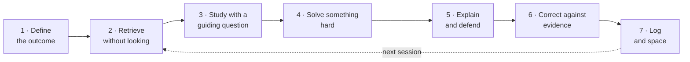

<p align="center">
  
</p>

<p align="center">
  <a href="LICENSE"></a>
  
  
  
  
</p>

<p align="center">
  <b>Un sistema operativo per l'apprendimento che trasforma Claude nel progettista del tuo piano,<br>
  direttore delle sessioni, tutor socratico e valutatore, nella tua lingua.</b>
</p>

<p align="center">
  <a href="#installa">Installa</a> ·
  <a href="#per-iniziare">Per iniziare</a> ·
  <a href="#il-metodo">Il metodo</a> ·
  <a href="examples/session-30-min.md">Vedi una sessione</a> ·
  <a href="agora/SKILL.md">Leggi la skill</a>
  <br>
  <b>Italiano</b> · <a href="README.md">English</a> · <a href="README.es.md">Español</a> · <a href="README.pt-BR.md">Português</a> · <a href="README.fr.md">Français</a>
</p>

---

## Perché esiste

Rileggere, sottolineare e registrare le ore _sembra_ produttivo, ma serve a poco. Le tecniche più efficaci (recuperare le informazioni senza guardare, dilazionare le ripetizioni, tentare prima di vedere la soluzione, spiegare e accettare le critiche) sono scomode e difficili da mantenere senza qualcuno che ti guidi.

Ágora è quel qualcuno. Prende le pratiche più trasferibili delle migliori università e le trasforma in un ciclo quotidiano, misurabile e adattivo, che funziona per qualsiasi materia e in qualsiasi lingua.

> **Ágora non promette di aumentare il QI e non lo misura mai.** Allena e misura la **prestazione osservabile**: comprensione profonda, trasferimento a problemi nuovi, spiegazioni chiare e qualità di ciò che produci.

## Cosa fa

| Modalità                    | Cosa succede                                                                                                                                                                                                                                          |
| --------------------------- | ----------------------------------------------------------------------------------------------------------------------------------------------------------------------------------------------------------------------------------------------------- |
| **Onboarding**              | 6 domande (obiettivo, materia, profilo, tempo, energia, con chi ne discuti) e viene creato il tuo quaderno dei progressi.                                                                                                                             |
| **Diagnostica**             | 85 minuti (oppure 2 parti o tre giorni da 30 minuti): lettura, memoria, logica, problemi, scrittura, spiegazione, metacognizione e attenzione. Assegna un livello: Fondamenti, Intermedio, Avanzato o Intensivo.                                      |
| **Piano di 12 settimane**   | Ogni settimana allena una capacità cognitiva usando il programma della _tua_ materia.                                                                                                                                                                 |
| **Sessione quotidiana**     | Routine precise di 30, 60, 120 o 180 minuti in 7 passaggi.                                                                                                                                                                                            |
| **Tutoraggio socratico**    | Non ti dà mai la risposta: chiede il tuo tentativo, mette alla prova le assunzioni, propone controesempi e aumenta la difficoltà, con una sequenza di suggerimenti da H1 a H5.                                                                        |
| **Modalità attenzione**     | Struttura opzionale adatta all'ADHD: blocchi da 10–20 minuti con un'unica attività visibile, pause di movimento, un rituale d'inizio, al massimo 8 schede al giorno, ripartenze invece di serie consecutive e una protezione dall'iperfocalizzazione. |
| **I tuoi materiali**        | Legge i tuoi PDF, appunti e programma, li collega al piano e scrive schede e problemi che citano le pagine. Gli esami passati vengono tenuti da parte per il test finale.                                                                             |
| **Ripetizione dilazionata** | Programmazione FSRS-6 con uno script senza dipendenze (passa alle caselle Leitner quando Python non è disponibile).                                                                                                                                   |
| **Revisioni**               | Metriche settimanali e mensili, con regole esplicite per aumentare o ridurre la difficoltà.                                                                                                                                                           |
| **Progetti**                | Progetti finali in ambito STEM, umanistico, aziendale e decisionale, di design e linguistico.                                                                                                                                                         |
| **Manuale**                 | Genera l'intero sistema come documento, nella tua lingua.                                                                                                                                                                                             |

Funziona per studenti delle scuole superiori con una preparazione avanzata, universitari, professionisti che apprendono una competenza complessa e autodidatti senza insegnante.

## Qualsiasi lingua

La skill è scritta in inglese e **parla a ogni studente nella propria lingua** (spagnolo, portoghese, italiano, francese, tedesco, inglese…): domande, feedback, rubriche, modelli e prompt del tutor. I nomi dei file restano in inglese affinché gli script continuino a funzionare.

Quando la materia _è_ una lingua, le istruzioni arrivano nella tua lingua e la pratica si svolge nella lingua obiettivo, con una maggiore immersione man mano che il tuo livello cresce (circa 30 % → 60 % → 90 %).

```text
Ágora, 60-minute session
Ágora, sesión de 60 minutos
Ágora, sessão de 60 minutos
Ágora, sessione di 60 minuti
```

## Modalità attenzione (adatta all'ADHD)

Attivabile a scelta, non è una diagnosi. Mantiene i metodi efficaci anche per gli studenti con ADHD (la pratica di recupero li aiuta quanto i loro coetanei) e cambia la struttura: blocchi brevi con un'unica attività visibile, pause di movimento, piani se-allora per le distrazioni, una «lista parcheggio», una micro-sessione di 10 minuti per le giornate con poca energia, revisioni limitate, ripartenze invece di serie consecutive e controlli del tempo affinché l'iperfocalizzazione non sottragga ore al sonno. Nessun consiglio sui farmaci e nessun «brain training», che non migliora i sintomi dell'ADHD né i voti nelle misurazioni in cieco. Vedi [`agora/references/attention.md`](agora/references/attention.md) e [un esempio di sessione](examples/session-attention-mode.md).

## Installa

**Dalla directory di Claude (il modo più semplice).** Ágora Learning è nella directory ufficiale dei plugin di Anthropic. In Claude (web, desktop, Cowork o Claude Code), apri **Customize**, cerca **Ágora Learning** e aggiungilo.

**Un comando (qualsiasi agente che supporti le skill).**

```bash
npx skills add Mlle-LondonG/agora-skill
```

**Plugin Claude Code.** All'interno di una sessione:

```text
/plugin marketplace add Mlle-LondonG/agora-skill
/plugin install agora-learning@agora-skill
```

**App Claude (web o desktop).** Scarica `agora.zip` dall'[ultima release](../../releases/latest) e caricalo nella sezione Skills delle impostazioni.

**Claude Code, manualmente.** Copia la cartella `agora/` nelle tue skill personali o in quelle di un progetto:

```bash
git clone https://github.com/Mlle-LondonG/agora-skill.git
cp -r agora-skill/agora ~/.claude/skills/          # for all your projects
# or: cp -r agora-skill/agora .claude/skills/      # for this project only
```

**Un'altra IA.** `agora/references/tutor.md` include un prompt pronto da incollare per un tutor socratico (chiedi ad Ágora di fornirtelo e lo riceverai tradotto).

**Aggiornamento dalla versione 1.x.** Rimuovi prima la vecchia versione spagnola. Ágora migra i notebook della versione 1.x (`perfil.md`, `sesiones.csv`…) al nuovo formato, conservando ogni riga e un backup degli originali.

## Per iniziare

Scrivi **"Ágora"** in una conversazione. La prima volta pone le domande di onboarding e propone la diagnostica. Dopodiché:

```text
Ágora, 60-minute session
Ágora, tutor me on recursion
Ágora, how am I doing?
Ágora, I'm stuck on integrals
Ágora, here are my lecture notes (attach PDFs)
Ágora, give me the full manual
```

## Il metodo

### Ogni sessione



| Passaggio    | 30 min | 60 min | 120 min | 180 min |
| ------------ | ------ | ------ | ------- | ------- |
| 1. Definisci | 1      | 2      | 3       | 5       |
| 2. Recupera  | 5      | 10     | 15      | 20      |
| 3. Studia    | 7      | 15     | 30      | 45      |
| Pausa        | —      | —      | 5       | 10      |
| 4. Risolvi   | 9      | 18     | 35      | 50      |
| Pausa        | —      | —      | —       | 5       |
| 5. Spiega    | 4      | 7      | 15      | 20      |
| 6. Correggi  | 2      | 5      | 10      | 15      |
| 7. Registra  | 2      | 3      | 7       | 10      |

### Le 12 settimane

| Fase                                | Settimane | Competenze                                                                                      |
| ----------------------------------- | --------- | ----------------------------------------------------------------------------------------------- |
| **I. Fondamenti del sistema**       | 1–4       | Attenzione profonda · memoria e calibrazione · primi principi · lettura critica                 |
| **II. Ragionamento**                | 5–8       | Logica e causalità · probabilità e decisioni · problemi quantitativi · scrittura e difesa orale |
| **III. Trasferimento e produzione** | 9–12      | Creatività e ipotesi · trasferimento · progetto finale · difesa e diagnostica finale            |

### Difficoltà adattiva

| Se il recupero senza appunti è…              | Ágora…                                                                |
| -------------------------------------------- | --------------------------------------------------------------------- |
| inferiore al 60%                             | non introduce nuovi contenuti: recupero, esempi svolti e prerequisiti |
| 60–79%                                       | dimezza i nuovi contenuti e raddoppia il recupero                     |
| 80–90%                                       | mantiene la difficoltà e lascia diradare le revisioni                 |
| superiore al 90% due volte **e** trasferisci | aumenta la complessità                                                |

In caso di insuccessi ripetuti distingue cinque cause, in quest'ordine: stanchezza, prerequisiti mancanti, strategia, mancanza di feedback o difficoltà eccessiva. Le regole per il riposo (6+1, un limite giornaliero, il sonno) proteggono dal burnout.

### Cosa prende da ciascuna istituzione

|               | Pratica                                      | In Ágora                                                      |
| ------------- | -------------------------------------------- | ------------------------------------------------------------- |
| **Harvard**   | Metodo dei casi, istruzione tra pari         | Caso settimanale con una decisione motivata; pari simulati    |
| **MIT**       | Imparare facendo, serie di problemi rigorose | La maggior parte di ogni sessione è dedicata alla risoluzione |
| **Cambridge** | Supervisioni in gruppi molto piccoli         | Lavoro scritto settimanale difeso davanti al tutor            |
| **Stanford**  | Design, prototipazione e iterazione          | Settimana della creatività e progetto di design               |

Nessuna di queste università usa un unico metodo; Ágora prende in prestito pratiche concrete, non «il metodo X».

## Il tuo quaderno

Con accesso alle cartelle, Ágora conserva i tuoi progressi nei file; senza, ti fornisce un blocco di stato da incollare la volta successiva. Inizia da [`notebook-template/`](notebook-template):

| File           | Scopo                                                                                                         |
| -------------- | ------------------------------------------------------------------------------------------------------------- |
| `profile.md`   | Obiettivo, livello, diagnostica e piano di 12 settimane                                                       |
| `sessions.csv` | Una riga per sessione con ogni metrica                                                                        |
| `errors.md`    | Registro degli errori per tipo (concetto, procedura, interpretazione errata, svista, strategia, prerequisito) |
| `cards.csv`    | Schede di ripasso con stato FSRS e pagine di origine                                                          |
| `reviews.md`   | Revisioni settimanali e mensili                                                                               |
| `sources.md`   | I tuoi materiali, glossario ed esami tenuti da parte                                                          |

Due script senza dipendenze (Python 3.8+) sono inclusi nella skill:

```bash
python3 agora/scripts/fsrs.py due cards.csv              # what to review today
python3 agora/scripts/fsrs.py review cards.csv c12 good  # log a review
python3 agora/scripts/metrics.py sessions.csv --days 7   # weekly summary + suggested rule
```

`fsrs.py` adatta FSRS-6 da [py-fsrs](https://github.com/open-spaced-repetition/py-fsrs); su 1.924 revisioni simulate ha prodotto esattamente le stesse date di ripasso della libreria di riferimento.

## Struttura della skill

Il file principale `SKILL.md` è breve: come plugin di Claude Code aggiunge circa 155 token a ogni sessione e circa 7.000 quando viene invocato. I protocolli dettagliati si trovano in `references/` e vengono letti solo quando una modalità ne ha bisogno.

```text
agora-skill/
├── .claude-plugin/              ← plugin + marketplace manifests for Claude Code
├── agora/
│   ├── SKILL.md                ← core: rules, language, router, session, adaptive rules
│   ├── references/
│   │   ├── diagnostic.md       ← 85-minute diagnostic, scoring, levels
│   │   ├── curriculum.md       ← 12 weeks, time and level adaptations
│   │   ├── tutor.md            ← Socratic protocol, supervision, copy-paste prompt
│   │   ├── topic-cycle.md      ← universal topic template + 4 worked examples
│   │   ├── evaluation.md       ← metrics, rubrics, reviews, blockage diagnosis
│   │   ├── practices.md        ← skills matrix, 14 practices, error manual
│   │   ├── projects.md         ← capstone projects
│   │   ├── notebook.md         ← file formats, FSRS/Leitner, state block
│   │   ├── sources.md          ← using your PDFs and notes
│   │   ├── attention.md        ← attention mode (ADHD-friendly)
│   │   └── evidence.md         ← references, ethics and health
│   └── scripts/
│       ├── fsrs.py
│       └── metrics.py
├── notebook-template/
├── examples/                   ← sessions in English, Spanish and Portuguese, plus attention mode
├── README.md · README.es.md · README.pt-BR.md
├── CHANGELOG.md
└── LICENSE
```

## Prove e limiti

Ogni pratica è classificata come **evidenza solida**, **evidenza moderata** o **suggerimento pratico**. I riferimenti si trovano in [`agora/references/evidence.md`](agora/references/evidence.md): Roediger & Karpicke (2006), Dunlosky et al. (2013), Cepeda et al. (2008), Freeman et al. (2014), Crouch & Mazur (2001), Kirschner, Sweller & Clark (2006), Bastani et al. (2025), tra gli altri.

Ágora **non sostituisce l'aiuto professionale** per ADHD, ansia, depressione, disturbi del sonno o altre condizioni.

## Progetti correlati

Altre skill open source per l'apprendimento che vale la pena conoscere, ciascuna con punti di forza diversi: [learning-opportunities](https://github.com/DrCatHicks/learning-opportunities) (esercizi basati sull'evidenza durante la programmazione assistita dall'IA), [learn-anything](https://github.com/ChenChenyaqi/learn-anything) (argomenti tecnici con dashboard), [Bloom](https://github.com/li-evan/bloom) (generazione di corsi dai tuoi documenti), [claude-tutor](https://github.com/kirilxd/claude-tutor) (piani, quiz e dashboard web), [study-skill](https://github.com/mordor-forge/study-skill) (FSRS-6 per lo studio della programmazione) e [education-agent-skills](https://github.com/GarethManning/education-agent-skills) (un'ampia libreria di skill per l'insegnamento e il tutoraggio, con valutazione delle evidenze). Le modalità di studio ospitate (ChatGPT Study Mode, Gemini Guided Learning, modalità di apprendimento di Claude, NotebookLM) offrono funzioni che una skill non può offrire, come dashboard integrate, elementi visivi o voce. La programmazione della ripetizione dilazionata si basa sul progetto [open-spaced-repetition](https://github.com/open-spaced-repetition).

## Contribuire

L'hai usata e qualcosa non ha funzionato, oppure hai un'idea? Apri una issue descrivendo cosa è successo, cosa ti aspettavi e, se possibile, includendo un estratto della conversazione. Le traduzioni del README e i nuovi esempi svolti sono particolarmente benvenuti.

## Privacy

Ágora non ha un server e non invia nulla da nessuna parte: il tuo quaderno resta nella tua cartella. Vedi [Privacy](PRIVACY.md).

## Licenza

[MIT](LICENSE) · Realizzato da [@Mlle-LondonG](https://github.com/Mlle-LondonG).
