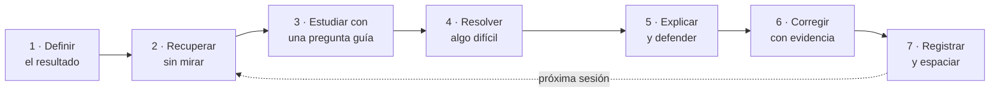

<p align="center">
  
</p>

<p align="center">
  <a href="LICENSE"></a>
  
  
  
</p>

<p align="center">
  <b>Un sistema operativo de aprendizaje que convierte a Claude en tu diseñador de plan,<br>
  director de sesión, tutor socrático y evaluador.</b>
</p>

<p align="center">
  <a href="#instalación">Instalación</a> ·
  <a href="#cómo-empezar">Cómo empezar</a> ·
  <a href="#el-método">El método</a> ·
  <a href="ejemplos/sesion-de-30-min.md">Ver una sesión</a> ·
  <a href="agora/SKILL.md">Leer el skill</a>
</p>

---

## Por qué existe

Releer, subrayar y acumular horas *se siente* productivo, pero rinde poco. Las técnicas que mejor funcionan (recuperar sin mirar, espaciar los repasos, resolver antes de ver la solución, explicar y recibir crítica) son incómodas y difíciles de sostener sin alguien que te guíe.

Ágora es ese alguien. Toma las prácticas más transferibles de las universidades de referencia y las convierte en un ciclo diario, medible y adaptativo que funciona con cualquier materia.

> **Ágora no promete subir el IQ ni lo mide.** Entrena y mide **rendimiento observable**: comprensión profunda, transferencia a problemas nuevos, claridad al explicar y calidad de lo que produces.

## Qué hace

| Modo | Qué pasa |
|---|---|
| **Inicio** | 6 preguntas (objetivo, materia, perfil, tiempo, energía, con quién discutes) y creación de tu cuaderno de progreso. |
| **Diagnóstico** | Prueba de 85 min (también en 2 partes o en 3 días de 30 min): lectura, memoria, lógica, problemas, escritura, explicación, metacognición y atención. Asigna nivel: Fundamentos, Intermedio, Avanzado o Intensivo. |
| **Plan de 12 semanas** | Cada semana entrena una habilidad cognitiva usando el temario de *tu* materia. |
| **Sesión diaria** | Rutinas exactas de 30, 60, 120 o 180 min en 7 pasos. |
| **Tutoría socrática** | No te da la respuesta: pide tu intento, cuestiona supuestos, plantea contraejemplos y sube la dificultad, con una escalera de pistas de P1 a P5. |
| **Revisión** | Métricas semanales y mensuales, y reglas explícitas para subir o bajar la dificultad. |
| **Proyectos** | Cuatro proyectos integradores: STEM, humanidades, negocios/decisión y diseño. |
| **Manual** | Genera el sistema completo como documento. |

Funciona para estudiantes de secundaria avanzada, universitarios, profesionales que aprenden una habilidad compleja y autodidactas sin profesor.

## Instalación

**App de Claude (web o escritorio).** Descarga [`agora.zip`](agora.zip) y súbelo en la sección de Skills de la configuración.

**Claude Code.** Copia la carpeta `agora/` en tus skills personales o en las de un proyecto:

```bash
git clone https://github.com/Mlle-LondonG/agora-skill.git
cp -r agora-skill/agora ~/.claude/skills/          # para todos tus proyectos
# o bien: cp -r agora-skill/agora .claude/skills/  # solo para este proyecto
```

**Otra IA.** La sección 10.3 de [`agora/SKILL.md`](agora/SKILL.md) trae un prompt de tutor socrático listo para copiar y pegar.

## Cómo empezar

Escribe **"Ágora"** en una conversación. La primera vez te hará las preguntas de inicio y te propondrá el diagnóstico. Después basta con:

```text
Ágora, sesión de 60 minutos
Ágora, tutoría sobre recursión
Ágora, ¿cómo voy?
Ágora, estoy atascada con las integrales
Ágora, dame el manual completo
```

## El método

### El ciclo de cada sesión



| Paso | 30 min | 60 min | 120 min | 180 min |
|---|---|---|---|---|
| 1. Definir | 1 | 2 | 3 | 5 |
| 2. Recuperar | 5 | 10 | 15 | 20 |
| 3. Estudiar | 7 | 15 | 30 | 45 |
| Pausa | — | — | 5 | 10 |
| 4. Resolver | 9 | 18 | 35 | 50 |
| Pausa | — | — | — | 5 |
| 5. Explicar | 4 | 7 | 15 | 20 |
| 6. Corregir | 2 | 5 | 10 | 15 |
| 7. Registrar | 2 | 3 | 7 | 10 |

### Las 12 semanas

| Fase | Semanas | Competencias |
|---|---|---|
| **I. Base del sistema** | 1–4 | Atención profunda · memoria y calibración · primer principio · lectura crítica |
| **II. Razonamiento** | 5–8 | Lógica y causalidad · probabilidad y decisión · problemas cuantitativos · escritura y defensa oral |
| **III. Transferencia y producción** | 9–12 | Creatividad e hipótesis · transferencia · proyecto integrador · defensa y diagnóstico final |

### Dificultad adaptativa

| Si la recuperación sin apuntes es… | Ágora… |
|---|---|
| menor que 60 % | no da contenido nuevo: recuperación, ejemplos resueltos y prerrequisitos |
| 60–79 % | reduce el contenido nuevo a la mitad y duplica la recuperación |
| 80–90 % | mantiene la dificultad y espacia los repasos |
| mayor que 90 % dos veces **y** hay transferencia | sube la complejidad |

Ante fallos repetidos distingue entre cinco causas, en este orden: fatiga, prerrequisitos, estrategia, falta de feedback o dificultad excesiva. Incluye reglas de descanso (6+1, techo diario, sueño) para evitar el agotamiento.

### Qué toma de cada institución

| | Práctica | En Ágora |
|---|---|---|
| **Harvard** | Método de casos, instrucción entre pares | Caso semanal con decisión defendida; simulación de pares |
| **MIT** | Aprender haciendo, problemas rigurosos | La mayor parte de cada sesión se resuelve |
| **Cambridge** | Supervisiones en grupos muy pequeños | Producción semanal defendida ante el tutor |
| **Stanford** | Diseño, prototipado e iteración | Semana de creatividad y proyecto de diseño |

Ninguna de estas universidades usa un único método; Ágora toma prácticas concretas, no "el método de X".

## Tu cuaderno

Si Claude tiene acceso a una carpeta, Ágora guarda tu progreso ahí. Si no, al cerrar cada sesión te da un bloque de estado para pegar en la siguiente. Puedes partir de [`cuaderno-plantilla/`](cuaderno-plantilla):

| Archivo | Para qué |
|---|---|
| `perfil.md` | Objetivo, nivel, diagnóstico y plan de 12 semanas |
| `sesiones.csv` | Una fila por sesión con todas las métricas |
| `errores.md` | Registro de errores por tipo (concepto, procedimiento, lectura, descuido, estrategia, prerrequisito) |
| `repasos.csv` | Banco de preguntas con cajas de repaso espaciado |
| `revisiones.md` | Revisiones semanales y mensuales |

[`scripts/metricas.py`](scripts/metricas.py) resume tus métricas y sugiere la regla adaptativa (solo usa la biblioteca estándar de Python):

```bash
python3 scripts/metricas.py ruta/a/sesiones.csv --dias 7
```

## Evidencia y límites

Cada práctica del skill indica si tiene **evidencia sólida**, **evidencia moderada** o si es una **sugerencia práctica**. Las referencias están en la sección 17 de [`SKILL.md`](agora/SKILL.md): Roediger & Karpicke (2006), Dunlosky et al. (2013), Cepeda et al. (2008), Freeman et al. (2014), Crouch & Mazur (2001), Kirschner, Sweller & Clark (2006), Bastani et al. (2025), entre otras.

Ágora **no sustituye la ayuda profesional** para TDAH, ansiedad, depresión, trastornos del sueño u otras condiciones.

## Estructura del repositorio

```text
agora-skill/
├── agora/
│   └── SKILL.md              ← el skill
├── agora.zip                 ← listo para subir a la app de Claude
├── cuaderno-plantilla/       ← cuaderno vacío para empezar
├── ejemplos/
│   └── sesion-de-30-min.md   ← cómo se ve una sesión
├── scripts/
│   └── metricas.py           ← resumen de métricas
├── assets/banner.svg
├── CHANGELOG.md
└── LICENSE
```

## Contribuir

¿Lo usaste y algo no funcionó, o se te ocurre una mejora? Abre un *issue* con lo que pasó, qué esperabas y, si puedes, un fragmento de la conversación.

## Licencia

[MIT](LICENSE) · Hecho por [@Mlle-LondonG](https://github.com/Mlle-LondonG).
