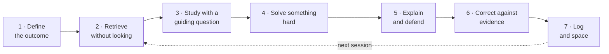

<p align="center">
  
</p>

<p align="center">
  <a href="LICENSE"></a>
  
  
  
  
</p>

<p align="center">
  <b>A learning operating system that turns Claude into your plan designer,<br>
  session director, Socratic tutor and assessor — in your own language.</b>
</p>

<p align="center">
  <a href="#install">Install</a> ·
  <a href="#getting-started">Getting started</a> ·
  <a href="#the-method">The method</a> ·
  <a href="examples/session-30-min.md">See a session</a> ·
  <a href="agora/SKILL.md">Read the skill</a>
  <br>
  <b>English</b> · <a href="README.es.md">Español</a> · <a href="README.pt-BR.md">Português</a>
</p>

---

## Why it exists

Rereading, highlighting and logging hours *feel* productive but pay off little. The techniques that work best (retrieving without looking, spacing reviews, attempting before seeing the solution, explaining and taking critique) are uncomfortable and hard to sustain without someone guiding you.

Ágora is that someone. It takes the most transferable practices of leading universities and turns them into a daily, measurable, adaptive loop that works for any subject and in any language.

> **Ágora does not promise to raise IQ, and it never measures it.** It trains and measures **observable performance**: deep understanding, transfer to new problems, clear explanations and the quality of what you produce.

## What it does

| Mode | What happens |
|---|---|
| **Onboarding** | 6 questions (goal, subject, profile, time, energy, who you discuss with) and your progress notebook is created. |
| **Diagnostic** | 85 minutes (or 2 parts, or three 30-minute days): reading, memory, logic, problems, writing, explaining, metacognition and attention. Assigns a level: Foundations, Intermediate, Advanced or Intensive. |
| **12-week plan** | Each week trains one cognitive skill using *your* subject's syllabus. |
| **Daily session** | Exact 30, 60, 120 or 180-minute routines in 7 steps. |
| **Socratic tutoring** | Never hands you the answer: asks for your attempt, probes assumptions, raises counterexamples and difficulty, with a hint ladder from H1 to H5. |
| **Attention mode** | Optional ADHD-friendly packaging: 10–20-minute blocks with one visible task, movement breaks, a start ritual, at most 8 cards a day, comebacks instead of streaks, and a hyperfocus guard. |
| **Your materials** | Reads your PDFs, notes and syllabus, maps them to the plan, and writes cards and problems that cite pages. Past exams are held out for the final test. |
| **Spaced repetition** | FSRS-6 scheduling with a dependency-free script (falls back to Leitner boxes when Python isn't available). |
| **Reviews** | Weekly and monthly metrics, with explicit rules for raising or lowering difficulty. |
| **Projects** | Capstones in STEM, humanities, business/decisions, design and languages. |
| **Manual** | Generates the whole system as a document, in your language. |

It works for advanced secondary students, university students, professionals learning a complex skill, and self-taught learners without a teacher.

## Any language

The skill is written in English and **talks to each learner in their own language** (Spanish, Portuguese, Italian, French, German, English…): questions, feedback, rubrics, templates and the tutor prompt. File names stay in English so the scripts keep working.

When the subject *is* a language, instructions come in your language and practice happens in the target language, with more immersion as your level rises (about 30 % → 60 % → 90 %).

```text
Ágora, 60-minute session
Ágora, sesión de 60 minutos
Ágora, sessão de 60 minutos
Ágora, sessione di 60 minuti
```

## Attention mode (ADHD-friendly)

Opt-in, never a diagnosis. It keeps the methods that work for students with ADHD too (retrieval practice helps them as much as their peers) and changes the packaging: short blocks with a single visible task, movement breaks, if-then plans for distractions, a "parking list", a 10-minute micro-session for low-energy days, capped reviews, comebacks instead of streaks, and time checks so hyperfocus doesn't eat into sleep. No medication advice and no "brain training", which doesn't improve ADHD symptoms or grades on blinded measures. See [`agora/references/attention.md`](agora/references/attention.md) and [an example session](examples/session-attention-mode.md).

## Install

**One command (any agent that supports skills).**

```bash
npx skills add Mlle-LondonG/agora-skill
```

**Claude Code plugin.** Inside a session:

```text
/plugin marketplace add Mlle-LondonG/agora-skill
/plugin install agora@agora-skill
```

**Claude app (web or desktop).** Download [`agora.zip`](agora.zip) (or the one attached to the [latest release](../../releases/latest)) and upload it in the Skills section of your settings.

**Claude Code, manually.** Copy the `agora/` folder into your personal skills or a project's:

```bash
git clone https://github.com/Mlle-LondonG/agora-skill.git
cp -r agora-skill/agora ~/.claude/skills/          # for all your projects
# or: cp -r agora-skill/agora .claude/skills/      # for this project only
```

**Another AI.** `agora/references/tutor.md` includes a ready-to-paste Socratic tutor prompt (ask Ágora for it and you get it translated).

**Upgrading from 1.x.** Remove the old Spanish version first. Ágora migrates 1.x notebooks (`perfil.md`, `sesiones.csv`…) to the new format, keeping every row and a backup of the originals.

## Getting started

Type **"Ágora"** in a conversation. The first time, it asks the onboarding questions and offers the diagnostic. After that:

```text
Ágora, 60-minute session
Ágora, tutor me on recursion
Ágora, how am I doing?
Ágora, I'm stuck on integrals
Ágora, here are my lecture notes (attach PDFs)
Ágora, give me the full manual
```

## The method

### Every session



| Step | 30 min | 60 min | 120 min | 180 min |
|---|---|---|---|---|
| 1. Define | 1 | 2 | 3 | 5 |
| 2. Retrieve | 5 | 10 | 15 | 20 |
| 3. Study | 7 | 15 | 30 | 45 |
| Break | — | — | 5 | 10 |
| 4. Solve | 9 | 18 | 35 | 50 |
| Break | — | — | — | 5 |
| 5. Explain | 4 | 7 | 15 | 20 |
| 6. Correct | 2 | 5 | 10 | 15 |
| 7. Log | 2 | 3 | 7 | 10 |

### The 12 weeks

| Phase | Weeks | Competencies |
|---|---|---|
| **I. System foundations** | 1–4 | Deep attention · memory and calibration · first principles · critical reading |
| **II. Reasoning** | 5–8 | Logic and causation · probability and decisions · quantitative problems · writing and oral defence |
| **III. Transfer and production** | 9–12 | Creativity and hypotheses · transfer · capstone project · defence and final diagnostic |

### Adaptive difficulty

| If recall without notes is… | Ágora… |
|---|---|
| below 60 % | gives no new content: retrieval, worked examples and prerequisites |
| 60–79 % | halves new content and doubles retrieval |
| 80–90 % | keeps the difficulty and lets reviews space out |
| above 90 % twice **and** you transfer | raises the complexity |

For repeated failure it distinguishes five causes, in this order: fatigue, missing prerequisites, strategy, lack of feedback, or excessive difficulty. Rest rules (6+1, a daily ceiling, sleep) guard against burnout.

### What it takes from each institution

| | Practice | In Ágora |
|---|---|---|
| **Harvard** | Case method, peer instruction | Weekly case with a defended decision; simulated peers |
| **MIT** | Learning by doing, rigorous problem sets | Most of each session is spent solving |
| **Cambridge** | Supervisions in very small groups | Weekly written work defended before the tutor |
| **Stanford** | Design, prototyping and iteration | Creativity week and design project |

None of these universities uses a single method; Ágora borrows concrete practices, not "the X method".

## Your notebook

With folder access, Ágora keeps your progress in files; without it, it gives you a state block to paste next time. Start from [`notebook-template/`](notebook-template):

| File | Purpose |
|---|---|
| `profile.md` | Goal, level, diagnostic and 12-week plan |
| `sessions.csv` | One row per session with every metric |
| `errors.md` | Error log by type (concept, procedure, misreading, slip, strategy, prerequisite) |
| `cards.csv` | Review cards with FSRS state and source pages |
| `reviews.md` | Weekly and monthly reviews |
| `sources.md` | Your materials, glossary and held-out exams |

Two dependency-free scripts (Python 3.8+) ship inside the skill:

```bash
python3 agora/scripts/fsrs.py due cards.csv              # what to review today
python3 agora/scripts/fsrs.py review cards.csv c12 good  # log a review
python3 agora/scripts/metrics.py sessions.csv --days 7   # weekly summary + suggested rule
```

`fsrs.py` ports FSRS-6 from [py-fsrs](https://github.com/open-spaced-repetition/py-fsrs); on 1,924 simulated reviews it matched the reference library's due dates exactly.

## Skill layout

The core `SKILL.md` is short: as a Claude Code plugin it adds about 155 tokens to every session and about 7k when invoked. Detailed protocols live in `references/` and are read only when a mode needs them.

```text
agora-skill/
├── .claude-plugin/              ← plugin + marketplace manifests for Claude Code
├── agora/
│   ├── SKILL.md                ← core: rules, language, router, session, adaptive rules
│   ├── references/
│   │   ├── diagnostic.md       ← 85-minute diagnostic, scoring, levels
│   │   ├── curriculum.md       ← 12 weeks, time and level adaptations
│   │   ├── tutor.md            ← Socratic protocol, supervision, copy-paste prompt
│   │   ├── topic-cycle.md      ← universal topic template + 4 worked examples
│   │   ├── evaluation.md       ← metrics, rubrics, reviews, blockage diagnosis
│   │   ├── practices.md        ← skills matrix, 14 practices, error manual
│   │   ├── projects.md         ← capstone projects
│   │   ├── notebook.md         ← file formats, FSRS/Leitner, state block
│   │   ├── sources.md          ← using your PDFs and notes
│   │   ├── attention.md        ← attention mode (ADHD-friendly)
│   │   └── evidence.md         ← references, ethics and health
│   └── scripts/
│       ├── fsrs.py
│       └── metrics.py
├── agora.zip                   ← ready to upload to the Claude app
├── notebook-template/
├── examples/                   ← sessions in English, Spanish and Portuguese, plus attention mode
├── README.md · README.es.md · README.pt-BR.md
├── CHANGELOG.md
└── LICENSE
```

## Evidence and limits

Every practice is labelled **solid evidence**, **moderate evidence** or **practical suggestion**. References are in [`agora/references/evidence.md`](agora/references/evidence.md): Roediger & Karpicke (2006), Dunlosky et al. (2013), Cepeda et al. (2008), Freeman et al. (2014), Crouch & Mazur (2001), Kirschner, Sweller & Clark (2006), Bastani et al. (2025), among others.

Ágora **does not replace professional help** for ADHD, anxiety, depression, sleep disorders or other conditions.

## Related work

Other open learning skills worth knowing, each with different strengths: [learning-opportunities](https://github.com/DrCatHicks/learning-opportunities) (evidence-based exercises during AI-assisted coding), [learn-anything](https://github.com/ChenChenyaqi/learn-anything) (technical topics with a dashboard), [Bloom](https://github.com/li-evan/bloom) (course generation from your documents), [claude-tutor](https://github.com/kirilxd/claude-tutor) (plans, quizzes and a web dashboard) [study-skill](https://github.com/mordor-forge/study-skill) (FSRS-6 for programming study) and [education-agent-skills](https://github.com/GarethManning/education-agent-skills) (a large, evidence-rated library of teaching and tutoring skills). Hosted study modes (ChatGPT Study Mode, Gemini Guided Learning, Claude's learning mode, NotebookLM) offer things a skill can't, such as built-in dashboards, visuals or voice. Spaced-repetition scheduling builds on the [open-spaced-repetition](https://github.com/open-spaced-repetition) project.

## Contributing

Used it and something didn't work, or have an idea? Open an issue with what happened, what you expected and, if you can, a snippet of the conversation. Translations of the README and new worked examples are especially welcome.

## Licence

[MIT](LICENSE) · Made by [@Mlle-LondonG](https://github.com/Mlle-LondonG).
